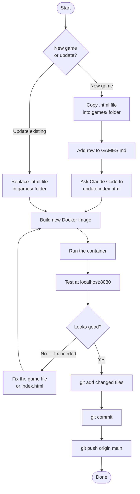

# Pap Games

A collection of single-page HTML games served via an NGINX Docker container with a styled game menu at the root.

## Project Structure

```
PapGames/
├── index.html          # Auto-generated game menu (managed by Claude Code)
├── Dockerfile          # Builds the NGINX container
├── nginx.conf          # NGINX server configuration
├── docker-compose.yml  # Compose file for easy container management
├── GAMES.md            # Source of truth — all declared games live here
└── games/
    └── Pap Puzzle.html # Individual game files
```

---

## How It Works

- `GAMES.md` is the source of truth. It declares every game by name and file path.
- Claude Code reads `GAMES.md` and maintains `index.html` automatically — you do not edit `index.html` by hand.
- The NGINX container serves `index.html` as the menu at `/` and all game files from `/games/`.

---

## Overall Workflow Flowchart



---

## Adding a New Game

1. **Place the game file** in the `games/` folder:
   ```
   games/My New Game.html
   ```

2. **Add a row to `GAMES.md`** following the existing format:
   ```
   | My New Game | ./games/My New Game.html |
   ```

3. **Ask Claude Code to update the menu.** In your Claude Code session, type:
   ```
   Please update index.html for the new games in GAMES.md.
   ```
   Claude Code will add the new game card to `index.html` automatically.

4. **Build and run the updated container** (see next section).

5. **Verify** by opening `http://localhost:8080` and confirming the new game card appears and links correctly.

---

## Updating an Existing Game

1. **Replace the file** in the `games/` folder with the updated version, keeping the same filename.

2. **Rebuild and run the container** (see next section).

3. **Verify** at `http://localhost:8080`.

> No changes to `GAMES.md` or `index.html` are needed for an update — only the game file itself changes.

---

## Building and Running the Container

### First time or after any change

```bash
# Build the image and start the container
docker compose up --build -d
```

- `-d` runs it in the background (detached mode).
- The site is available at **http://localhost:8080**.

### Stop the container

```bash
docker compose down
```

### Restart without rebuilding (e.g., after a compose-only config change)

```bash
docker compose up -d
```

### View logs

```bash
docker compose logs -f
```

---

## Committing and Pushing to GitHub

### First-time GitHub setup (one time only)

If you haven't linked this directory to a GitHub repository yet:

1. Create a new repository on [github.com](https://github.com) (do not initialize with a README — this project already has one).
2. In this directory, run:
   ```bash
   git init
   git remote add origin https://github.com/<your-username>/<repo-name>.git
   git branch -M main
   ```

### Committing and pushing changes

Run these commands from the `PapGames` directory after you have verified the container works correctly:

```bash
# 1. Stage all changed files
git add .

# 2. Commit with a descriptive message
git commit -m "Add My New Game"

# 3. Push to GitHub
git push origin main
```

> **Tip:** Always build and test the container locally before pushing. Push only verified, working changes.

---

## Asking Claude Code to Help

Claude Code manages this project. Common things to ask:

| What you want | What to type |
|---|---|
| Add a new game card after updating GAMES.md | `Please update index.html for the new games in GAMES.md.` |
| Rebuild the menu from scratch | `Please regenerate index.html from GAMES.md.` |
| Change the look of the menu | `Update the index.html styling to ...` |
